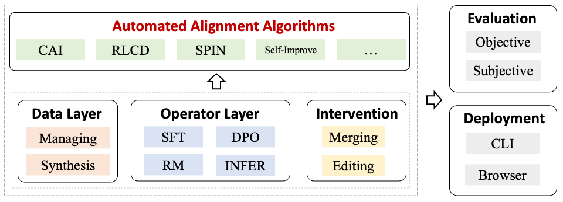

<p align="center">
    <a href="#-quick-start">🔥Quick Start</a> •
    <a href="#-features">📪Features</a> •
    <a href="#-reference-results">📈Results</a> •
    <a href="#-issues">🐛Issues</a> •
    <a href="#-citation">📜Citation</a>
</p>

## 📣 About

Auto-Alignment is a package focusing on scalable and automated alignment methods. We aim to provide the academic community with a series of classic alignment baselines and ready-to-use automated alignment algorithms. This toolkit is designed to facilitate research in the field of LLM alignment.

The core functionalities of the toolkit include:

- Implementation of common alignment operators (e.g., SFT, RM, DPO, etc.)
- Implementation of various automatic model alignment algorithms (e.g., CAI, SPIN, RLCD, etc.)
- Efficient model sampling
- Automated model evaluation
- Post-training intervertion methods (e.g., Represenatation Engineering, Model Averaging, etc.)



## 🚀 News

**[2024.8.23]** We are excited to announce the release of AutoAlign v0.0.1! In this first version, we have implemented a variety of alignment operators, including SFT, RM, and DPO, along with user-friendly evaluation systems and several auto-alignment algorithms(CAI, PCON, and a variant of RLCD), with more algorithms on the way. Stay tuned for future updates! 🔥🔥🔥

## 🔥 Quick Start

### 🔨 Environment Setup

*Default*

```
pip install .[train]
```

*Evaluation (Optional)*

```
pip install .[eval]
bash ./scripts/post_install.sh
```

### 📂 Data

We publicly release a collection of SFT data [here](). This toolkit currently utilizes the format in data/dummy_sft.json for supervised fine-tuning and the format in data/dummy_dpo.json for the reinforcement learning process. Please refer to these files for more details.

### 📚 Basic Training Operators

### SFT

``` bash
autoalign-cli sft \
            --model_name_or_path "Qwen2/Qwen2-7B" \
            --data_path "data/dummy_sft.json" \
            --bf16 True \
            --output_dir "models/qwen2-7b-sft" \
            --model_max_length 4096 \
            --conv_template_name chatml \
            --deepspeed "configs/zero3.json"
```

### Reward Modeling

```bash
autoalign-cli rm
```

### DPO

```bash
autoalign-cli dpo --model_name_or_path "Qwen2/Qwen2-7B-Instruct"  \
            --data_path "data/dummy_dpo.json" \
            --bf16 True \
            --output_dir "models/qwen2-7b-dpo" \
            --conv_template_name chatml \
            --deepspeed "configs/zero3.json"
```

### Inference

```bash
autoalign-cli infer --backend "vllm" \
            --model-name "Qwen2-0.5B-Instruct" \
            --model-path "Qwen/Qwen2-0.5B-Instruct" \
            --test-file "data/dummy_sft.json" \
            --template "chatml" \
            --source "qwen2_0_5b_instruct_dummy"
```

### Serve

```bash
autoalign-cli serve --checkpoint-path "Qwen2/Qwen2-7B-Instruct" \
                    --mode "browser" \
                    --template "chatml"
```

### Merge

```bash
autoalign-cli merge --model_paths "psmathur/orca_mini_v3_13b" "WizardLM/WizardLM-13B-V1.2" "garage-bAInd/Platypus2-13B" \
                    --merged_model_path "merged_model" \
                    --merging_method "average"
```

### 🛠 Automated Alignment Algorithms

The introduction and scripts for each automated alignment algorithm are stored in the [algorithms](./algorithms) folder.

Currently, we implemented the following automated alignment algorithms:

| Algorithm Name | Discription |
| -- | -- |
| [rlcd_sys](algorithms/rlcd_sys) | Context distilling the principles into the models using system prompts.  |
| [pcon](algorithms/pcon) | Treat the response from larger models as postitive signals, and the response from small models from negative signals. |

### ✏️ Model Evaluation

``` bash
autoalign-cli eval --config eval.yaml
```

You can configure inference parameters in the file `eval.yaml`. For objective evaluation, the results will be displayed in `outputs/{model_id}/ordered_res.txt` at the root directory of the repository. For more information, please read `docs/eval.md`.

## Documents

Documents of this toolkit is stored at ```./docs/```.

## Evaluation
### Objective evaluation


## 📪 Features

### Supported Models

| Model |	Template Name |
| -- | -- |
| Llama-2 | llama-2-chat |
| Llama-3 | llama-3-instruct |
| Llama-3.1 | llama-3-instruct |
| Gemma 2 | gemma |
| Qwen1.5 | chatml |
| Qwen2 | chatml |
| Mistral v0.1/0.2/0.3 | mistral-instruct / zepyhr |

## 📈 Reference Results

| Model | Dataset / Algorithm |	MT-Bench | MATH | GSM-8K | HumanEval | MBPP | HumanEval-CN | MBPP-CN | MMLU	| GPQA | CMMLU |C-Eval
| -- | -- | -- | -- | -- | -- | -- | -- | -- | -- | -- | -- | -- |
| Llama-2-7b | Base | -- | 3.32 | 16.91 | 14.63 |	17.4 | 9.76 |15.4 | 40.57 | 23.74 | 21.41 |	31.54
| Llama-2-7b | Chat | -- | 5.85	| 4.2 | 29.04 |7.32 | 22 | 4.88 | 18 | 42.89 | 19.7 | 30.63 | 34.82
| Llama-2-7b | Ultrachat | -- | 5.69 | 3.64 |21.91 | 19.51 | 16.4 | 15.85 | 14 | 42.65 | 25.25 |10.12 |	33.19
| Mistral-v0.1-7b | Base | -- | 11.32 | 48.67 |	13.41 | 36.4 | 20.73 | 35.8 | 56 | 23.23 | 34.76 | 47.57
| Mistral-v0.1-7b | Ultrachat | 5.28 | 5.7 | 30.02 | 19.51 | 19.4 | 17.68 | 16.8 | 49.04 | 21.72 | 12.01 | 32.96
| Llama-3-8b | Base | --  | 13.28 |	55.5 | 26.83 | 44.2 | 20.12 | 41.2 | x | 10.61 | 40.49 | x
| Llama-3-8b | Instruct | 7.95 | 25 | 78.62 | 52.44 |51.2 | 24.39 |	47.8 | 59.27 | 25.76 | 52.06 | 50.93
| Llama-3.1-8b | Ultrachat | 6.47 | 10.88	| 52.08 |	29.27	| 33.6 | 16.46 | 30.2 |	55.37 | 26.77 |	47.19 |	43.81
| Llama-3.1-8b | Base | --  | 15.24 | 56.41 | 27.44 | 42.8 | 23.78 | 41.8 | x |	12.63 | 45.43 |	x
| Llama-3.1-8b | Instruct | 7.73 | 31.56 | 81.12 | 54.27 | 53 | 39.02 | 50.2 | 59.88 | 28.79 |49.64 | 48.3
| Llama-3.1-8b | Ultrachat | 6.51	| 13.6 | 57.39 | 25.61 | 33.4 | 20.73 | 31.4 | 55.66 | 25.76 | 48.44 | 32.99 |
| Qwen-2-7b | Base | 5.03 | 41.3 |	79.76 | 61.59 | 51 | 60.37 | 48.4 |	62.4 |	31.31 |	67.72 |	42.66
| Qwen-2-7b | Instruct | 8.15	| 25.38 | 81.35	|51.22 | 48.6 | 61.59 | 24.2 | 64.1 | 31.82 | 62.24	| 46.04
| Qwen-2-7b | Ultrachat | 7.34 | 37.98 | 77.41 |	20.73 |	34.6 | 11.59 | 32.8 | 61.35 | 31.31 | 72.23 | 63.18
| Qwen-2-7b | rlcd_sys | 7.29	|	20.76 | 52.31 |	35.98 | 36 | 29.88 | 35.4 | 52.89 | 21.21 | 68.98 | 71.35
| Qwen-2-7b | pcon | 6.6 | 35.37 | 47.43 | 42.54 | 79.83 | 41.46 | 50.4	| 57.32 |	46.8 | 63.31 | 28.28 | 71.29 | 48.87

-- means unavailable, x means can not get valid performance with the default prompt of opencompass.

## 📅 Future Development Schedule

- Self-Improve
- Self-Rewarding
- SPIN
- CAI
- West-of-N
- Iterative DPO

## 🤝 Contributing

If you would like to contribute to this project, please follow these guidelines:

1. Fork the repository.
2. Create a new branch.
3. Make your changes.
4. Submit a pull request.

*Install for Develop*

```
pip install -e .[dev]
pre-commit install
```

## 📜 Citation

```bibtex
@software{AutoALign,
  author = {},
  version = {0.0.1},
  year = {2024}
}
```

## 💳 License

This project is licensed under the [Apache-2.0 License](LICENSE).
