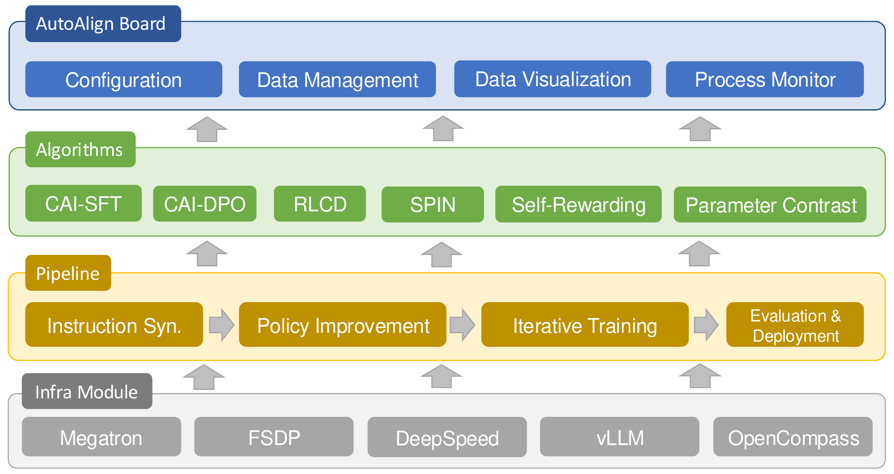
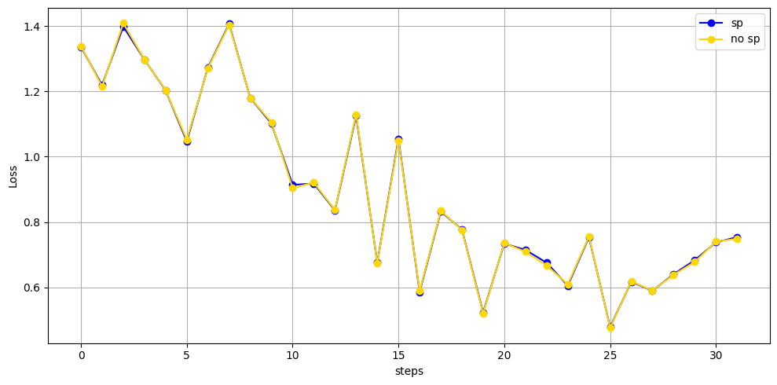

<p align="center">
    <a href="#-quick-start">🔥Quick Start</a> •
    <a href="#-features">📪Features</a> •
    <a href="#-reference-results">📈Results</a> •
    <a href="#-issues">🐛Issues</a> •
    <a href="#-citation">📜Citation</a> •
    <a href="https://autoalign.readthedocs.io/en/latest/">📄Docs</a>
</p>

## 📣 About

Auto-Alignment is a package focusing on scalable and automated alignment methods. We aim to provide the academic community with a series of classic alignment baselines and ready-to-use automated alignment algorithms. This toolkit is designed to facilitate research in the field of LLM alignment.

The core functionalities of the toolkit include:

- Implementation of common alignment operators (e.g., SFT, RM, DPO, GRPO, etc.)
- Implementation of various automatic model alignment algorithms (e.g., CAI, SPIN, RLCD, etc.)
- Efficient model sampling
- Automated model evaluation
- After training intervertion methods (e.g., Represenatation Engineering, Model Averaging, etc.)



## 🚀 News

**[2025.6.19]** We've integrated comprehensive safety evaluation datasets and released the Megatron implementation for large-scale distributed training.

**[2025.5.23]** AutoAlign has been accepted for presentation at the ACL 2025 Demo Track! 

**[2025.1.1]** AutoAlign now supports Self-Rewarding and Constitutional AI.

**[2024.8.23]** We are excited to announce the release of AutoAlign v0.0.1! In this first version, we have implemented a variety of alignment operators, including SFT, RM, and DPO, along with user-friendly evaluation systems and several auto-alignment algorithms (CAI, PCON, and a variant of RLCD), with more algorithms on the way. Stay tuned for future updates! 🔥🔥🔥

## 🔥 Quick Start

### 🔨 Environment Setup

**Default**

```
conda create -n ata python=3.10
conda activate ata
pip install .
pip install .[flash-attn]
```

**Evaluation (Optional)**

```
conda create -n ata_eval --clone ata
conda activate ata_eval
pip install .[eval]
bash ./scripts/post_install.sh
```

### 📂 Data

To facilite the community with out-of-box alignment data. We publicly release a collection of SFT data [here](https://lxylab.oss-cn-shanghai.aliyuncs.com/Auto-Alignment/data/inst_data.tar.gz). This toolkit currently utilizes the format in ```data/dummy_sft.json``` for supervised fine-tuning and the format in ```data/dummy_dpo.json``` for the reinforcement learning process. Please refer to these files for more details.

### 📚 Basic Alignment Operators

### SFT

``` bash
autoalign-cli sft \
            --model_name_or_path "Qwen/Qwen2.5-7B" \
            --data_path "data/dummy_sft.json" \
            --bf16 True \
            --output_dir "models/qwen2-7b-sft" \
            --model_max_length 4096 \
            --conv_template_name chatml \
            --deepspeed "configs/zero3.json"
```

We have implemented sequence parallel (SP) for SFT. If you want to use SP, please add these three parameters:

```bash
--sequence_parallel_size 8 \
--sequence_parallel_mode "ulysses" \
--cutoff_len 16000
```

- **`sequence_parallel_size`**: Used to set the number of GPUs to process a single sequence together. The default value is 1, which means SP is not used.

- **`sequence_parallel_mode`**: Specifies the specific implementation method of SP. We currently only support `ulysses`.

- **`cutoff_len`**: Used to specify the maximum length that the model can handle.

When using SP, gradient_accumulation_steps needs to be multiplied by sequence_parallel_size to equal the original batch size when not using SP.

Here is the comparison chart of the results with and without sp:


### Reward Modeling

You can first generate demo dataset by `python algorithms/rm/prepare_demo_rm.py`

And then run the following command:
```bash
autoalign-cli rm --model_name_or_path "meta-llama/Meta-Llama-3-8B-Instruct" \
    --data_path data/ultra_binary.jsonl \
    --bf16 True \
    --eval_path data/eval \
    --conv_template_name llama-3-instruct \
    --output_dir models/llama3_rm \
    --deepspeed configs/zero3.json
```

### DPO

```bash
autoalign-cli dpo --model_name_or_path "Qwen/Qwen2.5-7B-Instruct"  \
            --data_path "data/dummy_dpo.json" \
            --bf16 True \
            --output_dir "saved_models/qwen2-7b-dpo" \
            --conv_template_name chatml \
            --deepspeed "configs/zero3.json"
```

### Megatron-based Training
For detailed scripts configuration, please refer to the [megatron.md](docs/megatron.md).
1. Setup the environment:
```bash
pip install -e .
bash scripts/train/megatron/env_install.sh
```
> Setting up the environment may take half an hour as it involves compiling Apex, Flash-Attn, and Transformer Engine. Please be patient.
2. Convert weights from Hugging Face to Megatron:
```bash
bash scripts/train/megatron/convert/qwen2_5/convert_hf_to_mcore.sh
```
3. Preprocess the data:
```bash
# For SFT
bash scripts/train/megatron/preprocess/sft_conv.sh
# For DPO
bash scripts/train/megatron/preprocess/dpo_conv.sh
```
4. Run the training:
```bash
# For SFT
bash scripts/train/megatron/train/qwen2_5/sft_conv.sh
# For DPO
bash scripts/train/megatron/train/qwen2_5/dpo_conv.sh
```
5. Convert weights from Megatron back to Hugging Face::
```bash
# For SFT
bash scripts/train/megatron/convert/qwen2_5/convert_mcore_to_hf.sh
# For DPO
bash scripts/train/megatron/convert/qwen2_5/convert_mcore_to_hf_dpo.sh
```

### Inference

```bash
autoalign-cli infer --backend "vllm" \
            --model-name "Qwen2-0.5B-Instruct" \
            --model-path "Qwen/Qwen2-0.5B-Instruct" \
            --test-file "data/dummy_sft.json" \
            --template "chatml" \
            --source "qwen2_0_5b_instruct_dummy"
```

### Serve

```bash
autoalign-cli serve --checkpoint-path "Qwen/Qwen2.5-7B-Instruct" \
                    --mode "browser" \
                    --template "chatml"
```

### Merge

```bash
autoalign-cli merge --model_paths "psmathur/orca_mini_v3_13b" "WizardLM/WizardLM-13B-V1.2" "garage-bAInd/Platypus2-13B" \
                    --merged_model_path "merged_model" \
                    --merging_method "average"
```

### 🛠 Automated Alignment Algorithms

The introduction and scripts for each automated alignment algorithm are stored in the [algorithms](./algorithms) folder.

Currently, we implemented the following automated alignment algorithms:

| Algorithm Name | Discription |
| -- | -- |
| [rlcd_sys](algorithms/rlcd_sys) | Context distilling the principles into the models using system prompts.  |
| [pcon](algorithms/pcon) | Treat the response from larger models as postitive signals, and the response from small models from negative signals. |
| [self-rewarding](algorithms/self-rewarding) | Use language model itself to provide its own rewards during training via LLM-as-a-Judge prompting. |
| [cai](algorithms/cai) | A method for training LLMs to be harmless by using a set of guiding principles and a process of self-improvement through supervised and reinforcement learning. |

### ✏️ Model Evaluation

``` bash
autoalign-cli eval --config-path configs/eval.yaml
```

You can configure evaluation options in the file `eval.yaml`. For objective evaluation, the results will be displayed in `outputs/{model_id}/ordered_res.txt` at the root directory of the repository. For more information, please read `docs/eval.md`.

## Documents

Documents of this toolkit is stored at ```./docs/```.


## 📪 Features

### Supported Models

| Model |	Template Name |
| -- | -- |
| Llama-2 | llama-2-chat |
| Llama-3 | llama-3-instruct |
| Llama-3.1 | llama-3-instruct |
| Gemma 2 | gemma |
| Qwen1.5 | chatml |
| Qwen2 | chatml |
| Qwen2.5 | chatml |
| Mistral v0.1/0.2/0.3 | mistral-instruct / zepyhr |
| Yi1.5 | chatml |

## 📈 Reference Results

| Model | Dataset / Algorithm |	MT-Bench | MATH | GSM-8K | HumanEval | MBPP | HumanEval-CN | MBPP-CN | MMLU	| GPQA | CMMLU |C-Eval
| -- | -- | -- | -- | -- | -- | -- | -- | -- | -- | -- | -- | -- |
| Llama-2-7b | Base | -- | 3.32 | 16.91 | 14.63 | 17.4 | 9.76 |15.4 | 40.57 | 23.74 | 21.41 |	31.54
| Llama-2-7b | Chat | -- | 5.85	| 4.2 | 29.04 |7.32 | 22 | 4.88 | 18 | 42.89 | 19.7 | 30.63 | 34.82
| Llama-2-7b | Ultrachat | -- | 5.69 | 3.64 |21.91 | 19.51 | 16.4 | 15.85 | 14 | 42.65 | 25.25 |10.12 |	33.19
| Mistral-v0.1-7b | Base | -- | 11.32 | 48.67 |	13.41 | 36.4 | 20.73 | 35.8 | 56 | 23.23 | 34.76 | 47.57
| Mistral-v0.1-7b | Ultrachat | 5.28 | 5.7 | 30.02 | 19.51 | 19.4 | 17.68 | 16.8 | 49.04 | 21.72 | 12.01 | 32.96
| Llama-3-8b | Base | --  | 13.28 |	55.5 | 26.83 | 44.2 | 20.12 | 41.2 | x | 10.61 | 40.49 | x
| Llama-3-8b | Instruct | 7.95 | 25 | 78.62 | 52.44 | 51.2 | 24.39 | 47.8 | 59.27 | 25.76 | 52.06 | 50.93
| Llama-3.1-8b | Ultrachat | 6.47 | 10.88	| 52.08 | 29.27 | 33.6 | 16.46 | 30.2 |	55.37 | 26.77 |	47.19 |	43.81
| Llama-3.1-8b | Base | --  | 15.24 | 56.41 | 27.44 | 42.8 | 23.78 | 41.8 | x |	12.63 | 45.43 |	x
| Llama-3.1-8b | Instruct | 7.73 | 31.56 | 81.12 | 54.27 | 53 | 39.02 | 50.2 | 59.88 | 28.79 |49.64 | 48.3
| Llama-3.1-8b | Ultrachat | 6.51	| 13.6 | 57.39 | 25.61 | 33.4 | 20.73 | 31.4 | 55.66 | 25.76 | 48.44 | 32.99 |
| Qwen-2-7b | Base | 5.03 | 41.3 | 79.76 | 61.59 | 51 | 60.37 | 48.4 |	62.4 |	31.31 |	67.72 |	42.66
| Qwen-2-7b | Instruct | 8.15	| 25.38 | 81.35	|51.22 | 48.6 | 61.59 | 24.2 | 64.1 | 31.82 | 62.24	| 46.04
| Qwen-2-7b | Ultrachat | 7.34 | 37.98 | 77.41 | 20.73 | 34.6 | 11.59 | 32.8 | 61.35 | 31.31 | 72.23 | 63.18
| Qwen-2-7b | rlcd_sys | 7.29 | 20.76 | 52.31 |	35.98 | 36 | 29.88 | 35.4 | 52.89 | 21.21 | 68.98 | 71.35
| Qwen-2-7b | pcon | 6.6 | 35.37 | 47.43 | 42.54 | 79.83 | 41.46 | 50.4	| 57.32 | 46.8 | 63.31 | 28.28 | 71.29 | 48.87

"--" indicates data unavailable;

"x" indicates inability to obtain valid performance using OpenCompass default prompt.

## 📅 Future Development Schedule

### Benchmarks to be implemented at v0.1.x:

- Chat-Arena-Hard
- AlignBench

### Features to be supported at v0.2.x:

- Representation Engineering

## 🤝 Contributing

If you would like to contribute to this project, please follow these guidelines:

1. Fork the repository.
2. Install for Develop

    ```
    pip install -e .[dev]
    pre-commit install
    ```

3. Create a new branch.
4. Make your changes.
5. Submit a pull request.

## 📜 Citation

```bibtex
@software{AutoALign,
  author = {Xinyu, Lu and Dong, Xu and Chunkang, Zhang and Xinyan, Guan and Junxiang, Wang and Qingyu, Zhang and Pengbo, Wang and Yingzhi, Mao and Hao, Xiang and Xueru, Wen and Zichao, Li and Yaojie, Lu and Hongyu, Lin and Le, Sun and Xianpei, Han},
  version = {0.0.1},
  year = {2024},
  url = {https://github.com/icip-cas/AutoAlign}
}
```

## 💳 License

This project is licensed under the [Apache-2.0 License](LICENSE).
