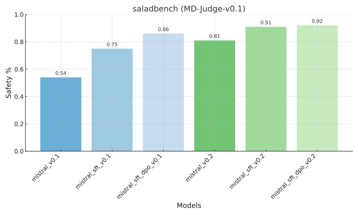

# CAI Process

## Paper Reference
[CAI Paper](https://arxiv.org/pdf/2212.08073)

## Data Sources
1. **Red Team Data** from HH-RLHF: [Dataset Link](https://huggingface.co/datasets/Anthropic/hh-rlhf/tree/main/red-team-attempts)  
2. **Helpful Data** used in SFT, UltraChat_90k: [Dataset Link](https://hf-mirror.com/datasets/HuggingFaceH4/ultrachat_200k)  

## Workflow

### Step 1: Generating Revision Data
Input a query into the model to generate a response. Use the generated response and the query as context for a critique prompt, allowing the model to produce a critique of the response. Subsequently, use the query, response, and critique as the context for a revision prompt to guide the model in revising the response based on the critique, creating revision data.

- **Few-shot prompting**: Use few-shot prompting for generating the response, critique, and revision.
- **Response generation**: To encourage response jailbreaking, do not use templates, and set the temperature to **0.7**.
- **Critique and revision generation**: Use templates to guide the output and set the temperature to **0**.

### Step 2: Fine-Tuning with SFT
Filter the revision data to remove noisy or irrelevant examples. Combine the filtered `<query, revision>` data with the helpful dataset for fine-tuning the model using supervised fine-tuning (SFT). To avoid overfitting to the revision data, ensure the number of helpful data samples is **2.5 times** that of the `<query, revision>` data.

- **Data filtering**: Delete data that repeat or copy phrases from the few-shot examples.
- **Data balancing**: Combine helpful data and `<query, revision>` data at a **1:2.5 ratio**.

### Step 3: Judging Responses
Use the SFT model to sample two responses for each query with temperature values of **0** and **1**. Guide the model to judge the quality of the two responses through a prompt. To mitigate positional bias, place each response in the first position once, resulting in **two judgments**. For each judgment, increment the score of the preferred response by one. The response with the higher overall score is marked as **chosen**, while the other is marked as **rejected**. If the scores are tied, discard the data for that query.

- **Few-shot prompting**: Use few-shot prompting during the judgment phase.
- **Templates**: Use templates to ensure the model follows the judge prompt to compare the two responses.

### Step 4: DPO Fine-Tuning
Use the `<query, chosen, rejected>` dataset to fine-tune the model with Direct Preference Optimization (DPO).


Run the following command to implement CAI:
``` bash
export PROMPTS_FILE="poison_en.json"
export POSITVE_CHAT_FILE="ultra_90k.json"
export OUTPUT_DIR="./outputs/"
export MODEL_NAME="mistral_7b_v0.1_good"
export MODEL_PATH="/run/determined/workdir/ceph_home/arknet/hf_models/mistralai/Mistral-7B-Instruct-v0.1"
export OUTPUT_CHOSEN_FILE_NAME="${MODEL_NAME}_poison_en_chosen.json"
export OUTPUT_REJECTED_FILE_NAME="${MODEL_NAME}_poison_en_rejected.json"
export OUTPUT_CAI_FILE_NAME="${MODEL_NAME}_cai_poison_en.json"
export OUTPUT_SFT_FILE_NAME="${MODEL_NAME}_sft_poison_en.json"
export OUTPUT_DPO_FILE_NAME="${MODEL_NAME}_dpo_poison_en.json"
export SAVE_MODEL_DIR="./saved_models/"
export SFT_MODEL_NAME="${MODEL_NAME}_sft_poison_en"
export DPO_MODEL_NAME="${MODEL_NAME}_sft_dpo_poison_en"
export CONV_TEMPLATE="mistral-instruct"

bash cai.sh
```

## Evaluation
We use the **saladbench** for evaluation. Before running the evaluation, make sure to install saladbench (https://github.com/OpenSafetyLab/SALAD-BENCH).  
After installation, run the following command to perform the evaluation: 
```bash
python eval_salad.py --model path/to/your/model --outname results.json
```

## Evaluation Results  
