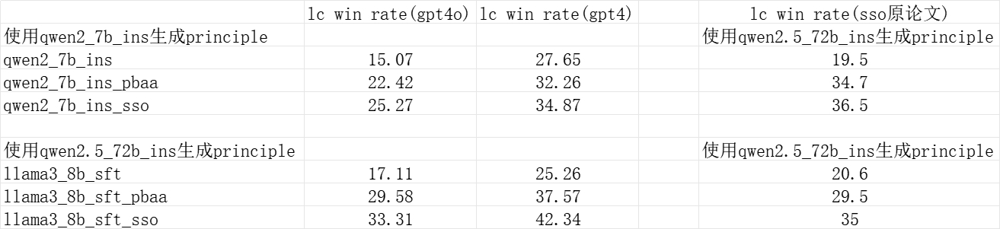

# SSO算法实现

## 运行流程

### 1. 构建原则数据
```bash
bash build_principles.bash
```
此脚本基于提示构建原则。

### 2. 构建SSO训练数据
```bash
bash build_sso_data.bash
```
此脚本生成generator训练数据。

### 3. 执行SSO训练
```bash
bash sso.bash
```
训练generator。

### 4. 构建DPO数据
```bash
bash build_dpo_data.bash
```
使用generator生成dpo数据。

### 5. 执行DPO训练
```bash
bash dpo.bash
```
对初始模型进行dpo训练。

## 快速开始

要运行完整的训练流程，只需依次执行以下命令：

```bash
bash build_principles.bash
bash build_sso_data.bash
bash sso.bash
bash build_dpo_data.bash
bash dpo.bash
```
## 实现效果
